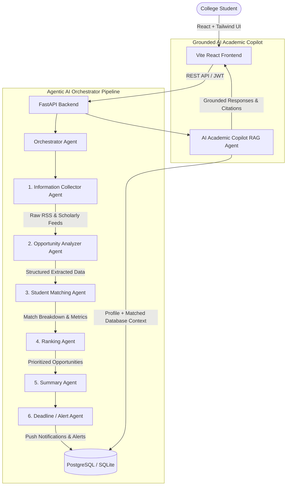

# 🎓 Academic Intelligence Agent

> **An Autonomous Multi-Agent Personal Academic Intelligence Platform for College Students.**

Academic Intelligence Agent is a full-stack, production-ready Agentic AI web platform designed to discover, extract, personalize, rank, summarize, and alert college students about high-impact academic opportunities—including hackathons, research fellowships, scholarships, internships, grants, and student competitions.

---

## 🏗️ System Architecture



---

## 🤖 Multi-Agent System Roles & Responsibilities

| Agent | Responsibility | Output / Actions |
| :--- | :--- | :--- |
| **1. Information Collector Agent** | Scans active trusted feeds (RSS, academic portals, APIs) | Preserves canonical URLs, provenance, and publication timestamps |
| **2. Opportunity Analyzer Agent** | Semantic extraction using Google Gemini LLM | Standardized schema (eligibility, dates, skills, financial models, locations) |
| **3. Student Matching Agent** | Calculates transparent dimensional alignment | Output: `overall_match`, `skill_match`, `eligibility_match`, `interest_match`, `deadline_urgency`, `matched_skills`, `missing_skills`, `explanation` |
| **4. Ranking Agent** | Multi-factor dynamic prioritization algorithm | Generates composite `rank_score` blending match weight, urgency, and student priorities |
| **5. Summary Agent** | Distills complex postings into student-friendly summaries | High-impact 2-3 sentence executive briefs, key takeaways, and action items |
| **6. Deadline & Alert Agent** | Monitors approaching dates and high-match discovery | Triggers urgency alerts (Critical &le;3d, Approaching &le;7d) and push notifications |
| **7. Grounded AI Academic Copilot** | Conversational advisor grounded in real DB data | Answers queries without hallucination with clickable opportunity citations |

---

## 💻 Tech Stack

### Frontend
- **React 18** (Modern functional components & Hooks)
- **Vite** (Lightning-fast dev & optimized production bundler)
- **Tailwind CSS** (Sleek dark/light theme, glassmorphic UI, responsive layouts)
- **Recharts** (Interactive category and match distribution visualizations)
- **Lucide React** (Modern iconography)

### Backend
- **Python 3.10+** / **FastAPI** (High-performance asynchronous REST API)
- **SQLAlchemy 2.0** (Dual PostgreSQL & SQLite out-of-the-box support)
- **Pydantic v2** (Type-safe data validation & settings)
- **Bcrypt & Python-Jose** (Secure JWT authentication and password hashing)

### AI & Agents
- **Google Gemini API** (`gemini-2.5-flash` / `gemini-1.5-flash` with structured JSON output)
- Resilient structured heuristic fallback ensuring seamless operation offline or without API key

---

## 🚀 Getting Started

### Option 1: Quick Local Run (Zero Configuration)

#### 1. Backend Setup
```bash
# Navigate to backend
cd backend

# Install Python dependencies
pip install -r requirements.txt

# Start FastAPI server (defaults to local SQLite database with demo seeds)
uvicorn app.main:app --reload --port 8000
```
*The backend will automatically create tables, load demo sources, seed realistic student opportunities, and start at `http://localhost:8000`.*

#### 2. Frontend Setup
```bash
# In a new terminal, navigate to frontend
cd frontend

# Install npm dependencies
npm install

# Start Vite development server
npm run dev
```
*Open `http://localhost:5173` in your browser.*

---

### Option 2: Docker Compose (Full Stack with PostgreSQL)

```bash
# Run PostgreSQL + FastAPI + React Frontend with a single command
docker-compose up --build
```
- Frontend: `http://localhost:3000`
- Backend API & Interactive Swagger Docs: `http://localhost:8000/docs`
- PostgreSQL: `localhost:5432`

---

## 🔑 Demo Presentation Credentials

For immediate testing, click **"One-Click Login as Demo Student"** in the UI or use:

- **Email**: `alex.chen@university.edu`
- **Password**: `student123`

---

## 🗄️ Database Schema

The database model is structured into normalized tables:

- `users`: User account, role (`student`/`admin`), authentication state.
- `student_profiles`: Academic credentials (degree, major, college, graduation year), skills (JSON), interests (JSON), preferred categories, mode preference, GPA, resume summary, profile strength.
- `opportunities`: Normalized academic opportunities with title, organization, description, summary, category, eligibility, deadline, location, mode, cost, required skills, tags, official canonical URL, source provenance, demo flag.
- `opportunity_skills`: Normalized link between opportunities and specific technical/domain skills.
- `user_matches`: Computed multi-dimensional match breakdowns between student and opportunity (`overall_match`, `skill_match`, `eligibility_match`, `interest_match`, `deadline_urgency`, `matched_skills`, `missing_skills`, `explanation`, `rank_score`).
- `saved_opportunities`: User application tracker (`saved`, `in_progress`, `applied`, `archived`) and notes.
- `deadlines`: Temporal deadline urgency events (`critical`, `approaching`, `upcoming`, `normal`).
- `notifications`: Student notification inbox with urgency badges.
- `trusted_sources`: Configured ingestion feeds and RSS channels for autonomous collector agents.

---

## 📡 API Endpoints Overview

| Method | Endpoint | Description |
| :--- | :--- | :--- |
| `POST` | `/api/v1/auth/login/json` | Student login returning JWT access token |
| `POST` | `/api/v1/auth/register` | Student registration & profile initialization |
| `GET` | `/api/v1/profile/me` | Retrieve student profile and preferences |
| `PUT` | `/api/v1/profile/me` | Update student profile (auto-recalibrates matches) |
| `GET` | `/api/v1/profile/strength` | Calculate profile strength score and tips |
| `GET` | `/api/v1/opportunities` | Search & filter opportunities (category, mode, cost, match %) |
| `GET` | `/api/v1/opportunities/{id}` | Detailed opportunity view with match rationale |
| `GET` | `/api/v1/matches/top` | Retrieve top ranked recommendations for current student |
| `POST` | `/api/v1/matches/refresh` | Force on-demand re-match evaluation |
| `GET` | `/api/v1/saved` | List saved & in-progress applications |
| `POST` | `/api/v1/saved` | Save / update application status |
| `GET` | `/api/v1/deadlines` | Get upcoming deadlines and calendar events |
| `GET` | `/api/v1/deadlines/metrics` | Get urgency counts (&le;3d, &le;7d, &le;14d) |
| `GET` | `/api/v1/notifications` | List user notification alerts |
| `POST` | `/api/v1/notifications/read` | Mark notifications as read |
| `POST` | `/api/v1/agents/run` | Trigger full 6-agent autonomous pipeline execution |
| `GET` | `/api/v1/agents/status` | Real-time agent status & pipeline execution logs |
| `POST` | `/api/v1/assistant/chat` | Grounded AI Academic Copilot chat endpoint |
| `GET` | `/api/v1/analytics/dashboard` | Dashboard metrics and category distribution |

---

## 🧪 Running Automated Tests

```bash
PYTHONPATH=backend pytest backend/tests/test_api.py -v
```

---

## 🛡️ Security & Best Practices

- **Secret Isolation**: Server-side API key and secret storage via `.env`.
- **Password Security**: Direct salt-hashed passwords using `bcrypt`.
- **Input Validation**: All API inputs and JSON schemas strictly validated with Pydantic v2.
- **Cross-Origin Security**: Configurable CORS policies in FastAPI settings.
- **Zero-Hallucination Grounding**: AI Assistant response synthesis strictly injects verified database context and user match attributes.
